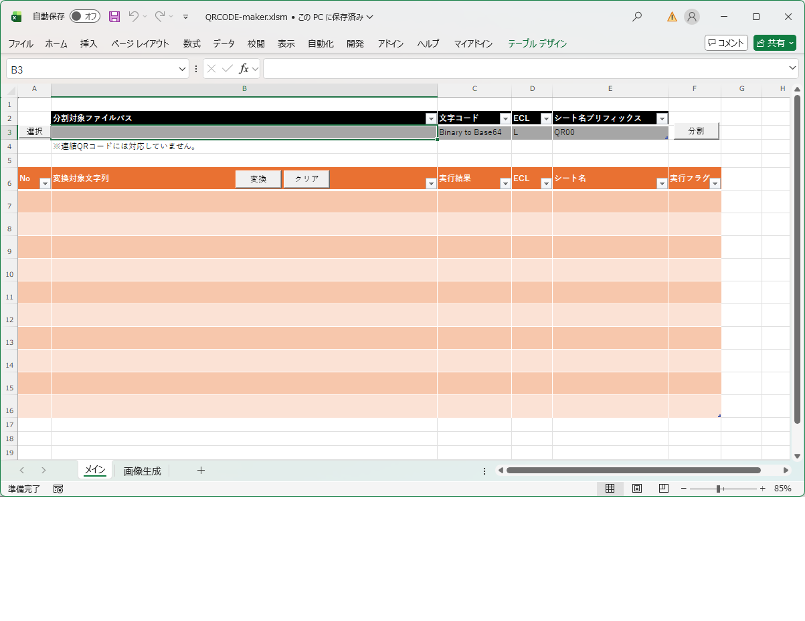
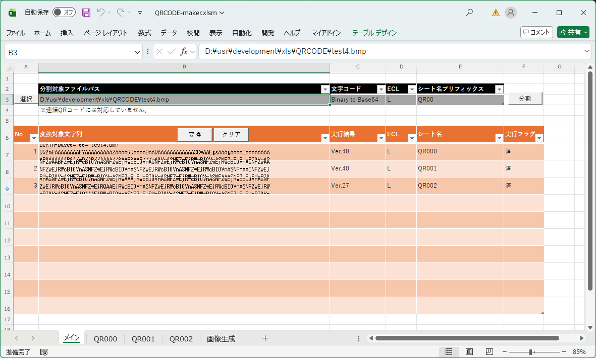
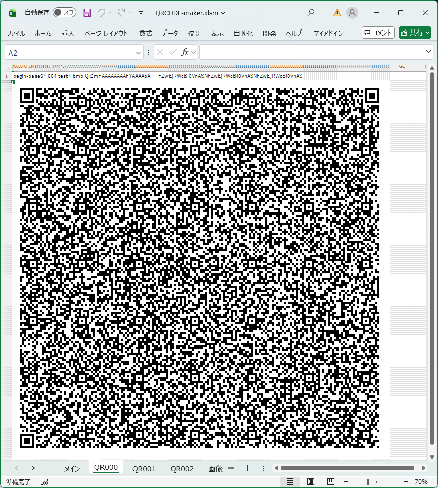
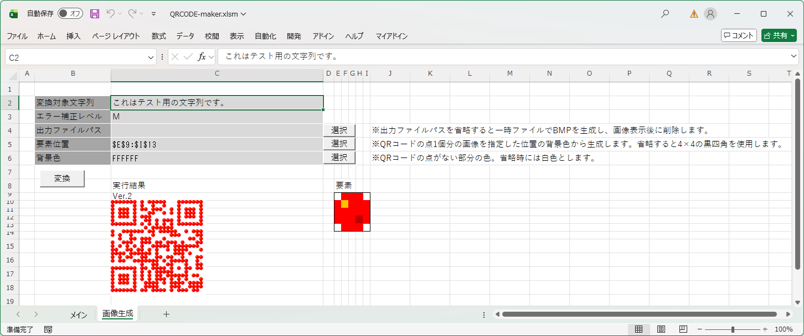

# このツールについて

このツールはEXCEL VBAマクロのみで動作するQRコード作成ツールです。

# 機能
- 入力された文字列を元に、同じEXCELファイル中の別シートのセル上にQRコードを生成します。
- テキストファイルのファイルパスと文字コードを指定することで、QRコードに変換可能な状態に行単位で分割できます。
- バイナリファイルのファイルパスを指定し、文字コードの欄で"Binary to base64"を選択することで、バイナリファイルをBase64化した上でQRコードに変換可能な状態に行単位で分割できます。
- 複数の文字列を一括で複数のQRコードに変換できます。
- 指定した文字列のQRコードを画像として生成できます。

# 画面
 - 初期画面
   

 - 分割したファイルを変換した後
   

 - 出力されたQRコード
   

 - 画像生成
   

# 使用方法

## 文字列をQRコードに変換するには

1. メインシートを選択します。
2. 変換対象リストの\[変換対象文字列\]にQRコードにしたい文字列を記述します。
3. 変換対象リストのエラー補正レベル(ECL)を選択します。L→M→Q→Hの順でQRコードの汚損に強くなりますが、
   同じサイズのQRコードに格納可能な文字数が少なくなります。
   省略した場合、変換実施時にLが選択されます。
4. 変換対象リストのシート名に出力先シート名を入力します。省略した場合、変換実施時に出力したシート名が記載されます。
5. 変換対象リストの実行フラグに文字が入っていないことを確認します。
6. \[変換\]ボタンを押下します。
   別シートに変換結果が出力されます。
   変換対象リストの複数行の\[変換対象文字列\]に記入されていて、それぞれの実行フラグ列が空欄である場合、一括で変換を実行します。
   出力する行のシート名列に同じシート名が記述されていた場合、同じシートに複数のQRコードを出力します。
   シート名が記述されていない場合はそれぞれ個別のシートに出力します。
7. \[実行結果\]に変換処理の実行結果が出力されます。成功した場合にはQRコードのバージョンが、失敗した場合はエラーメッセージが出力されます。

## テキストファイルを読み込んで分割し、複数のQRコードに変換するには

1. メインシートを選択します。
2. 分割対象リストの分割対象ファイルパスに読み込むテキストファイルのパスを入力します。
   \[選択\]ボタンを押下することでテキストファイルを選択することもできます。
3. 分割対象リストの文字コードを選択します。残念ながら自動認識はしません。
4. 分割対象リストのエラー補正レベル(ECL)を選択します。省略した場合、Lが選択されます。
5. 分割対象リストのシート名プリフィックスを入力します。
   分割を実行した場合、このプリフィックスの末尾に連番をつけたシート名が変換対象リストのシート名に展開されます。
   省略した場合、分割を実行時には変換対象リストのシート名には何も展開されません。
6. \[分割\]ボタンを押下します。
   変換対象リストが空でない場合、クリアするかどうかを確認します。
   クリアしなかった場合、空いている行に分割結果が展開されます。
   変換対象リストに選択されたファイルの内容が展開されます。
   読み込んだファイルを行単位で分割するため、1行が長すぎる場合は分割に失敗する場合があります。
7. 分割に成功したら、\[変換\]ボタンを押下します。
8. \[実行結果\]に変換処理の実行結果が出力されます。

## バイナリファイルを読み込んで分割し、複数のQRコードに変換するには

1. メインシートを選択します。
2. 分割対象リストの分割対象ファイルパスに読み込むバイナリファイルのパスを入力します。
   \[選択\]ボタンを押下することでバイナリファイルを選択することもできます。
3. 分割対象リストの文字コードにおいて\[Binary to base64\]を選択します。
   残念ながら選択したファイルがバイナリかどうかの自動認識はしません。
4. 分割対象リストのエラー補正レベル(ECL)を選択します。
5. 分割対象リストのシート名プリフィックスを入力します。
6. \[分割\]ボタンを押下します。
7. 分割に成功したら、\[変換\]ボタンを押下します。
8. \[実行結果\]に変換処理の実行結果が出力されます。

## 文字列を画像形式のQRコードに変換するには

1. 画像生成シートを選択します。
2. \[変換対象文字列\]にQRコードにしたい文字列を記述します。
3. エラー補正レベル(ECL)を選択します。
4. \[出力ファイルパス\]を入力します。
   出力ファイル\[選択\]ボタンから保存先を入力可能です。
   省略した場合、一時ファイルとして出力し、実行結果に画像を貼り付けた後に一時ファイルを削除します。
5. \[要素位置\]を入力します。
   要素とは、QRコードのドットを構成する画像のことです。
   選択されたセル範囲の背景色を読み取って画像を生成します。
   要素位置\[選択\]ボタンでセル範囲を選択可能です。
   省略した場合、4pixel角の黒四角で画像を生成します。
     - 大きさに制限はつけていませんが、極端なサイズはQRコードリーダーが認識できないでしょう。
     - 縦横が同じ大きさが望ましいですが、異なっていても出力可能です。
     - 色が薄すぎる場合、QRコードリーダーが正常に読み取れなくなる可能性があります。
     - 異なるシート上のセルを指定することも可能です。
     - 複数範囲を指定すると最初の範囲が使用されます。
6. \[背景色\]をRGB順の16進数で入力します。
   背景色\[選択\]ボタンで色を選択可能です。
   省略した場合、白色(FFFFFF)が使用されます。
     - 色が濃すぎる場合、QRコードリーダーが正常に読み取れなくなる可能性があります。
7. \[変換\]ボタンを押下します。
   前に出力した画像は残したままで生成するので注意。
8. \[実行結果\]に変換処理の実行結果が出力されます。

# 実装

## QRコード

このツールの中心となっている[QRCodeModule](src/QRCodeModule.bas)は以下のバーコード生成ライブラリから
QRコードの生成に必要な分を抜き出し、修正したものです。

https://code.google.com/archive/p/barcode-vba-macro-only/downloads

オリジナルとは以下の点が異なります。
- 漢字モードに対応しました。
- UTF-8の3byte以上の文字が指定されたとき、正常に動作するようにしました。
- オリジナルは出力先がShapeでしたが、2次元配列出力としてあります。
- サイズ計算時にend of chainのサイズを考慮に入れるようにしました。
- 解析のため、大きなサブルーチンを分解しました。ローカル変数の利用範囲を限定したかったので。
     - QR_genの大部分を以下のサブルーチンに分解しました。
       |サブルーチン名  |機能                    |元の記述位置                            |
       |----------------|------------------------|----------------------------------------|
       |QR_anlyz        |文字列解析              |QR_paramsの呼び出しの手前まで。         |
       |||※文字列解析においてecx_pocに加算している部分と、eb(i, 4)に格納してから変数cに合算している部分はビット長計算部分としてQR_search_paramsに移動しました。|
       |QR_encd         |エンコードブロック生成  |QR_paramsの呼び出し後からQR_rs手前まで。|
       |QR_initArr      |QRコード初期設定        |QR_rsの呼び出し後からQR_fill手前まで。  |
       |QR_maskArr      |マスク処理              |QR_fillの呼び出し後                     |
       |QR_maskArr_addMM|マスク処理              |addmmサブルーチン                       |
       |QR_makeAscMtrx  |バーコード表現文字列生成|最後の部分                              |

     - QR_paramsの一部を分解しました。
          - CheckQRCodeから呼び出すためにバージョン探索部分をQR_search_paramsとして独立させました。

     - qr_xormaskの一部を分解しました。
          - スコア計算部分をQR_xorMask_scoringとして独立させました。

- 解析のため、ユーザー定義を使用するようにしました。
  |ユーザー定義名 |元の記述 |説明    |
  |--------------|--------|--------|
  |tEcxItem     |QR_genにおけるecx_cnt(3)、ecx_pos(3)、ecx_poc(3) |解析している途中の文字種ごとのバイト数と位置と総バイト数を管理していました。ecx_pocは不要になったので削除しました。 |
  |tEbItem      |QR_genにおけるeb(20, 4)                          |解析結果を保持する部分。 |
  |tParams      |QR_genにおけるqrp(15)                            |QR_paramsでバージョンとECLで決定されるパラメタを保持。 |

- 文字列解析を作り直しました。
     - オリジナルは数字のみの入力は英数字モードで出力しましたが、数字モードで出力します。
     - オリジナルはモード別ブロックが最大20でしたが、無制限としました。

## BMPファイル出力

[BMPModule](src/BMPModule.bas)はグラフィックファイルフォーマット・ハンドブックの記述を頼りに構築しました。
- 1bit、4bit、8bit、24bit形式の無圧縮形式で生成します。
- 入力は出力ファイルパス、ニ次元配列マップ、一次元配列のカラーインデックス、解像度(dpi)です。
     - カラーインデックスにはLong形式のColor配列を指定します。
     - カラーインデックスを指定した場合は二次元配列マップをカラーインデックスに対応するインデックスマップとして扱います。
     - カラーインデックスを指定しなかった場合は二次元配列マップを24bitカラーマップとして扱います。
- 24bitカラーマップの色数を計上してカラーインデックスとインデックスマップを生成する関数を用意しました。
